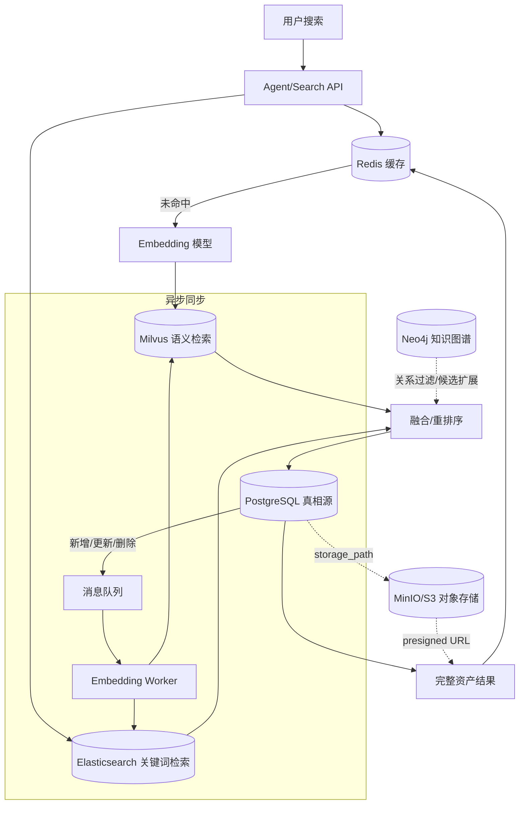

# 智能体数据库学习总路线

## 1. 这一节要解决什么问题

这一节帮你看清 AI Agent 项目里常见的数据系统：PostgreSQL、Milvus、Redis、Elasticsearch、消息队列、对象存储、Neo4j 分别是什么，为什么需要它们，应该按什么顺序学，以及每一部分学到什么程度算过关。

这套路线不是只为了快速做一个 demo。demo 只是检验理解的方式。真正目标是：你能把智能体系统里的数据流、检索流、同步流、文件流和高并发问题讲清楚，并能在项目中做出合理设计。

---

## 2. 你的项目背景

公司有一套短剧资产管理系统，PostgreSQL 中已有这些表：

| 表名 | 存什么 |
| --- | --- |
| `asset_entities` | 角色、场景、道具等资产实体，包含名称、描述、类型 |
| `asset_media` | 图片、视频、音频等媒体资源路径 |
| `asset_source_projects` | 资产来源项目信息 |
| `asset_variants` | 资产的不同变体版本 |
| `project_asset_refs` | 项目和资产的关联关系 |
| `project_director_storyboard` | 导演分镜/分镜脚本 |
| `project_prompts` | 项目的生成提示词 |

你要围绕这个业务场景学习：

```text
结构化数据怎么存？
语义搜索怎么做？
向量库和关系库怎么关联？
图片、视频这类大文件怎么管理？
搜索结果怎么缓存？
PG 更新后 Milvus 怎么同步？
关键词搜索和语义搜索怎么结合？
关系复杂时为什么会引入图数据库？
高并发时每一层怎么扛压？
```

---

## 3. 基础概念解释

### PostgreSQL

通俗解释：PostgreSQL 是系统里最可靠的“账本”，所有核心业务数据都以表的形式存放在这里。

技术解释：PostgreSQL 是关系型数据库，支持 SQL、事务、索引、外键、JSON、全文检索等能力，适合存结构化业务数据。

在你的项目里：`asset_entities`、`asset_media`、`project_prompts` 这些表都在 PG 里。PG 是真相源，Milvus、Redis、ES 都更像围绕它建立的检索或性能副本。

### Milvus

通俗解释：Milvus 是“按意思找东西”的数据库。用户搜“古风仙女角色”，它可以找到描述里没写这几个字但语义接近的资产。

技术解释：Milvus 是向量数据库，用来存储 embedding 向量，并通过余弦相似度、L2、内积等方式做近似最近邻搜索。

在你的项目里：把 `name + description + tags` 转成 embedding，写入 Milvus。搜索后 Milvus 返回 `source_id`，再回 PG 查完整资产信息。

### Embedding

通俗解释：Embedding 是把文字、图片等内容变成一串数字，让机器可以计算“相不相似”。

技术解释：Embedding 模型会把输入映射到高维向量空间，语义相近的内容在空间中距离更近。

在你的项目里：资产描述、分镜描述、prompt 都可以转成向量，用于语义搜索和推荐。

### Redis

通俗解释：Redis 是高速缓存。经常被搜的内容，不必每次都重新查 Milvus、PG、调用 embedding。

技术解释：Redis 是内存数据库，支持 String、Hash、List、Set、ZSet、Stream 等数据结构，常用于缓存、计数、排行榜、轻量消息队列。

在你的项目里：缓存搜索结果、缓存 query embedding、做 Redis Stream 异步任务队列。

### Elasticsearch

通俗解释：Elasticsearch 是“按关键词找东西”的搜索引擎，适合精确匹配、模糊匹配、高亮、布尔查询。

技术解释：ES 基于倒排索引和 BM25 算法，擅长全文检索、过滤、聚合和日志分析。

在你的项目里：Milvus 擅长语义相似，ES 擅长关键词命中。两者结合可以做混合检索。

### 对象存储 MinIO/S3

通俗解释：图片、视频、音频不要直接塞进数据库，而是放到专门存大文件的仓库里，PG 只保存文件路径。

技术解释：对象存储以 bucket/object 的形式管理文件，适合大容量、分布式、可扩展的非结构化文件存储。

在你的项目里：`asset_media.storage_path` 指向 MinIO/S3 中的真实文件，搜索结果展示时生成 presigned URL。

### 消息队列

通俗解释：消息队列像任务排队区。用户更新资产后，系统不用马上等 embedding 算完，而是把任务丢进队列，由后台 worker 慢慢处理。

技术解释：消息队列用于异步处理、削峰填谷、失败重试和解耦生产者/消费者。

在你的项目里：PG 数据新增/更新/删除后，发消息给 worker，异步更新 Milvus。

### Neo4j

通俗解释：Neo4j 用来存“谁和谁有什么关系”。当问题不只是查一张表，而是沿着多层关系找东西时，图数据库更自然。

技术解释：Neo4j 是图数据库，用节点和边表示实体关系，通过 Cypher 查询多跳关系路径。

在你的项目里：可以表示角色、场景、道具、项目之间的关系，用于关系推荐和图增强检索。

---

## 4. 为什么要学这些

智能体不是只会调用大模型。真正能落地的智能体，背后通常有一套数据系统：

```text
PG 负责保存可靠业务数据。
Milvus 负责语义搜索。
ES 负责关键词搜索。
Redis 负责缓存和削峰。
对象存储负责大文件。
消息队列负责异步同步。
Neo4j 负责复杂关系。
高并发架构负责稳定性。
```

如果只学单个数据库，你可能会知道命令，但不知道它在智能体系统中的位置。按这条路线学，重点是建立“组件之间怎么配合”的能力。

---

## 5. 关键知识点

### 5.1 完整目录结构

```text
database-learning/
├── 00_智能体数据库学习总路线.md
├── 01_PostgreSQL基础与项目实战.md
├── 02_Milvus向量数据库入门.md
├── 03_入库方案设计与实现.md
├── 04_Redis缓存与检索优化.md
├── 05_检索链路设计.md
├── 06_Elasticsearch与混合检索.md
├── 07_消息队列与异步架构.md
├── 08_高并发数据库架构.md
├── 09_Neo4j与知识图谱.md
├── 10_对象存储与文件管理.md
└── 11_一周落地计划.md
```

注意事项：编号代表文档生成顺序，不一定代表最严格的学习顺序。比如对象存储编号是 10，但理解 `asset_media` 时就可以提前看。

### 5.2 十一阶段学习路线

| 阶段 | 学什么 | 对应文件 | 学完能做什么 |
| --- | --- | --- | --- |
| 第一阶段 | PostgreSQL 基础和项目表结构 | 01 | 能读懂 7 张业务表，写 JOIN 查询 |
| 第二阶段 | 对象存储和媒体文件管理 | 10 | 能解释为什么 PG 存路径、文件放 MinIO/S3 |
| 第三阶段 | Milvus 和向量检索 | 02 | 能理解文本转向量、Collection、Index、Search |
| 第四阶段 | PG 到 Milvus 的入库方案 | 03 | 能判断哪些字段向量化，写入库脚本 |
| 第五阶段 | 完整检索链路 | 05 | 能设计 query → Milvus → PG 回查 → 返回结果 |
| 第六阶段 | Redis 缓存和检索优化 | 04 | 能设计缓存 key、TTL、失效和防击穿方案 |
| 第七阶段 | Elasticsearch 和混合检索 | 06 | 能解释关键词检索、BM25、RRF 融合 |
| 第八阶段 | 消息队列和异步同步 | 07 | 能设计 PG 更新后异步刷新 Milvus |
| 第九阶段 | 高并发数据库架构 | 08 | 能分析 1000 人同时搜索时瓶颈在哪里 |
| 第十阶段 | Neo4j 和知识图谱 | 09 | 能建模角色、场景、项目之间的多跳关系 |
| 第十一阶段 | 一周落地计划 | 11 | 能用小 demo 串起整套知识 |

注意事项：这不是“只做第十一阶段就行”。第十一阶段是复习和验证，前十个阶段才是知识主体。

### 5.3 全景架构图



### 5.4 核心数据流

入库流程：

```text
PG 读取资产
-> 筛选语义字段
-> 拼接 embedding_text
-> 调用 embedding 模型
-> 写入 Milvus
-> 保存 source_table/source_id/metadata
```

检索流程：

```text
用户 query
-> Redis 查缓存
-> query 转向量
-> Milvus 语义召回
-> ES 关键词召回
-> 融合排序/重排序
-> 根据 source_id 回查 PG
-> 从对象存储生成媒体 URL
-> 返回结果并写缓存
```

同步流程：

```text
PG 数据变更
-> 发消息到队列
-> Worker 消费任务
-> 重新生成 embedding
-> 更新 Milvus/ES
-> 清理相关 Redis 缓存
```

---

## 6. 7 天快速入门版

目标：先建立全局理解，知道每个组件在智能体数据系统里的位置。

| 天数 | 学习内容 | 阅读文件 | 动手任务 | 达标标准 |
| --- | --- | --- | --- | --- |
| 第 1 天 | PG 表结构和 SQL | 00、01 | 画 7 张表关系图，写 5 条 JOIN | 能解释每张表存什么 |
| 第 2 天 | 对象存储和媒体路径 | 10 | 设计 `asset_media` 与 MinIO 路径规则 | 能说清 PG 为什么不存视频 |
| 第 3 天 | 向量检索和 Milvus | 02 | 创建测试 Collection，插入 5 条向量 | 能解释 Collection/Field/Index |
| 第 4 天 | 入库方案 | 03 | 写 `build_embedding_text()` 伪代码 | 能判断字段是否适合向量化 |
| 第 5 天 | 检索链路 | 05 | 画 query 到结果返回的流程图 | 能解释 source_id 回查 PG |
| 第 6 天 | Redis 和 ES | 04、06 | 设计缓存 key；比较语义搜索和关键词搜索 | 能说清两者解决什么问题 |
| 第 7 天 | MQ、高并发、Neo4j 总览 | 07、08、09 | 写一页学习复盘 | 能讲出每个组件的定位 |

注意事项：7 天版重点是建立地图，不要求所有代码都跑通。

---

## 7. 14 天系统学习版

目标：把核心概念和基础实践都过一遍，能看懂项目里的数据库和检索设计。

| 天数 | 学什么 | 看哪些文件 | 动手做什么 | 当天目标 |
| --- | --- | --- | --- | --- |
| 1 | 总览和组件定位 | 00 | 画全景架构图 | 知道每个组件的位置 |
| 2 | PG 基础 SQL | 01 | SELECT/JOIN/GROUP BY 练习 | 能查资产和媒体 |
| 3 | PG 表关系和索引 | 01 | 画 ER 图，写 EXPLAIN 笔记 | 理解真相源和索引 |
| 4 | 对象存储 | 10 | 设计 storage_path 规范 | 理解文件和元数据分离 |
| 5 | Milvus 基础 | 02 | 创建 Collection 和 Index | 理解向量库核心概念 |
| 6 | Milvus 搜索 | 02 | 插入测试向量并搜索 | 理解 topK 和 score |
| 7 | 入库字段分析 | 03 | 给每张表做字段分类 | 知道什么进 Milvus |
| 8 | 入库脚本 | 03 | 写批量入库伪代码 | 理解幂等和批处理 |
| 9 | 检索链路 | 05 | 设计搜索 API 流程 | 理解回查和重排序 |
| 10 | Redis 缓存 | 04 | 设计缓存 key/TTL | 理解缓存失效问题 |
| 11 | ES 混合检索 | 06 | 对比 ES 和 Milvus | 理解关键词与语义互补 |
| 12 | 消息队列 | 07 | 设计增量同步消息格式 | 理解异步和重试 |
| 13 | 高并发 | 08 | 分析 1000 人搜索链路 | 能定位瓶颈 |
| 14 | Neo4j | 09 | 设计角色-场景-项目图模型 | 理解多跳关系 |

注意事项：14 天版每天 1.5 到 3 小时，先把概念和设计想清楚，代码可以逐步补。

---

## 8. 30 天项目实战版

目标：做出一个“短剧资产智能搜索系统”的学习项目，用项目把数据库知识串起来。

| 阶段 | 天数 | 内容 | 产出 |
| --- | --- | --- | --- |
| 数据源阶段 | 1-4 | 学 PG、表关系、对象存储 | ER 图、SQL 查询、媒体路径设计 |
| 向量阶段 | 5-10 | 学 embedding、Milvus、入库脚本 | Milvus Collection、字段分析、入库流程 |
| 检索阶段 | 11-15 | 学检索链路、回查、重排序 | 搜索 API 设计、结果排序方案 |
| 缓存阶段 | 16-18 | 学 Redis 缓存和失效 | 缓存 key 规范、防击穿策略 |
| 混合检索阶段 | 19-21 | 学 ES、BM25、RRF | ES + Milvus 融合方案 |
| 异步同步阶段 | 22-24 | 学消息队列、worker、死信 | PG 变更同步 Milvus 的设计 |
| 架构阶段 | 25-27 | 学高并发、连接池、副本、限流 | 高并发架构图和瓶颈分析 |
| 图谱阶段 | 28-29 | 学 Neo4j 和知识图谱 | 角色-场景-项目图模型 |
| 复盘阶段 | 30 | 汇总文档和面试表达 | README、架构图、问题清单 |

---

## 9. 学习方法建议

```text
学 PostgreSQL：每个概念都落到一条 SQL。
学 Milvus：每个字段都问“为什么进向量库”。
学 Redis：每个缓存都问“什么时候失效”。
学 ES：每个查询都问“关键词比语义强在哪里”。
学消息队列：每个任务都问“失败后怎么办”。
学高并发：每个请求都问“压力打到哪一层”。
学 Neo4j：每条边都问“这个关系是否真的需要多跳查询”。
```

不要把数据库学习成孤立命令。要始终围绕一个问题：

```text
用户搜索一个资产时，数据从哪里来，经过哪些组件，最后怎么返回？
```

---

## 10. 实战任务

1. 画一张你的短剧资产系统数据架构图，包含 PG、Milvus、Redis、ES、MinIO、MQ、Neo4j。
2. 写出 `asset_entities` 中哪些字段适合向量化，哪些字段只适合做 metadata。
3. 设计一个搜索接口：输入 query、asset_kind、project_id，输出资产列表和图片 URL。
4. 设计 Redis 缓存 key，例如 `search:{query_hash}:{filters_hash}`。
5. 设计 PG 更新资产后同步 Milvus 的消息格式。
6. 写出 Milvus 挂了、Redis 挂了、PG 慢了时分别怎么降级。

---

## 11. 检查自己是否学会

1. 为什么 PostgreSQL 是真相源？
2. 为什么 Milvus 里要存 `source_table` 和 `source_id`？
3. 哪些字段适合转 embedding？哪些不适合？
4. 为什么图片、视频不要直接存在 PG？
5. Redis 缓存搜索结果时，缓存 key 应该包含哪些信息？
6. ES 和 Milvus 分别适合什么搜索场景？
7. PG 更新后，Milvus 为什么允许短暂不一致？
8. 消息消费失败后应该怎么处理？
9. 1000 人同时搜索时，瓶颈可能出在哪些层？
10. 什么时候用 Neo4j，而不是继续写 PG JOIN？

---

## 12. 常见误区

1. 误区：学智能体数据库就是学 PostgreSQL。  
   解释：PG 是核心，但智能体系统还需要向量检索、缓存、文件存储、异步同步和检索优化。

2. 误区：有了 Milvus 就不需要 ES。  
   解释：Milvus 擅长语义相似，ES 擅长关键词、精确匹配、高亮和复杂布尔查询。

3. 误区：Redis 只是为了快。  
   解释：Redis 还涉及缓存一致性、热点 key、防击穿、防雪崩和成本优化。

4. 误区：把所有数据都塞进 Milvus。  
   解释：Milvus 只应该存向量、轻量 metadata 和回查 ID。完整业务数据仍然在 PG。

5. 误区：消息队列是高并发才需要。  
   解释：只要有耗时任务、失败重试、异步同步，就可能需要队列。

6. 误区：Neo4j 看起来高级，所以应该早点用。  
   解释：只有多跳关系成为核心查询对象时，图数据库才真正有价值。

---

## 13. 本节总结

这套数据库学习路线的核心不是“背组件名”，而是理解智能体数据系统如何协作：

```text
PG 管真相。
Milvus 管语义。
ES 管关键词。
Redis 管速度。
MinIO/S3 管文件。
MQ 管异步。
Neo4j 管关系。
高并发设计管稳定性。
```

学的时候可以先用一周计划建立全局感，再用 14 天系统学习补齐知识，最后用 30 天项目实战把它们串成一个完整作品。最终你要能独立回答：一个智能体搜索资产时，每个数据库为什么存在、存什么、怎么同步、怎么查、坏了怎么办。
