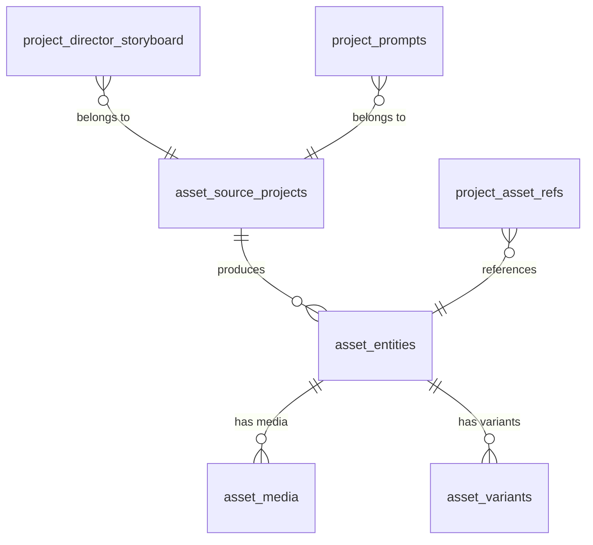

# PostgreSQL 基础与项目实战

> 第一阶段核心文档：读懂公司表结构，掌握基础SQL，理解PG在智能体系统中的角色

---

## 学习目标

1. 理解关系型数据库的核心概念（表、行、列、主键、外键、索引）
2. 能读懂公司7张表的结构和关联关系
3. 能写 SELECT / JOIN / WHERE / GROUP BY / 子查询
4. 理解 PG 在智能体系统中作为"真相源"的定位

---

## PostgreSQL 是什么

一句话：**用表格存储结构化数据，用 SQL 语言查询，支持事务保证数据可靠的数据库。**

类比：Excel 表格的超级加强版——支持几亿行数据、多人同时读写、复杂条件筛选、表之间关联查询。

---

## 核心概念

| 概念 | 解释 | 你项目中的例子 |
|------|------|---------------|
| 表(Table) | 一类数据的集合，有固定列结构 | asset_entities 表存所有资产实体 |
| 行(Row) | 表中的一条记录 | 一个角色"白衣仙女"就是一行 |
| 列(Column) | 数据的一个属性 | name, description, asset_kind |
| 主键(PK) | 唯一标识一行的字段 | asset_entities.id (UUID) |
| 外键(FK) | 指向另一张表的字段 | asset_media.asset_id → asset_entities.id |
| 索引(Index) | 加速查询的数据结构 | 给 name 列建索引，搜索快100倍 |
| 事务 | 一组操作全成功或全失败 | 创建资产+上传媒体必须同时成功 |
| Schema | 数据库的命名空间 | public schema（默认） |

---

## 公司表结构关系图



### 各表职责

| 表 | 存什么 | 关键字段 |
|----|--------|---------|
| asset_entities | 资产主体信息 | id, name, description, asset_kind, tags, source_project_id |
| asset_media | 资产关联的媒体文件 | id, asset_id, media_type, storage_path, url |
| asset_source_projects | 资产来源的项目 | id, project_name, description |
| asset_variants | 同一资产的不同变体 | id, asset_id, variant_name, params |
| project_asset_refs | 项目引用了哪些资产 | project_id, asset_id, usage_type |
| project_director_storyboard | 分镜脚本 | id, project_id, scene_index, description, prompt |
| project_prompts | 生成提示词 | id, project_id, prompt_text, model, params |

---

## 基础 SQL 操作

### 查询单表

```sql
-- 查看所有角色类型的资产
SELECT id, name, description 
FROM asset_entities 
WHERE asset_kind = 'character';

-- 模糊搜索名称包含"仙"的资产
SELECT * FROM asset_entities 
WHERE name LIKE '%仙%';

-- 按创建时间排序，取前10条
SELECT * FROM asset_entities 
ORDER BY created_at DESC 
LIMIT 10;
```

### 多表 JOIN

```sql
-- 查出角色资产及其第一张图片
SELECT 
    e.id, e.name, e.description,
    m.url AS image_url
FROM asset_entities e
LEFT JOIN asset_media m ON m.asset_id = e.id AND m.media_type = 'image'
WHERE e.asset_kind = 'character'
LIMIT 20;

-- 查出某个项目下所有资产及来源项目名
SELECT 
    e.name AS asset_name,
    e.asset_kind,
    sp.project_name AS source_project
FROM project_asset_refs ref
JOIN asset_entities e ON e.id = ref.asset_id
JOIN asset_source_projects sp ON sp.id = e.source_project_id
WHERE ref.project_id = 'proj_001';
```

### 聚合统计

```sql
-- 统计每种资产类型的数量
SELECT asset_kind, COUNT(*) as total
FROM asset_entities
GROUP BY asset_kind
ORDER BY total DESC;

-- 统计每个项目引用了多少资产
SELECT project_id, COUNT(*) as asset_count
FROM project_asset_refs
GROUP BY project_id
HAVING COUNT(*) > 5;
```

### 索引与性能

```sql
-- 查看查询执行计划（判断是否用了索引）
EXPLAIN ANALYZE
SELECT * FROM asset_entities WHERE name = '白衣仙女';

-- 创建索引加速按名称搜索
CREATE INDEX idx_entities_name ON asset_entities(name);

-- 创建复合索引（按类型+名称查询时用）
CREATE INDEX idx_entities_kind_name ON asset_entities(asset_kind, name);
```

---

## 在智能体系统中的角色

PG 是**数据真相源（Source of Truth）**：

1. **所有结构化数据都存这里**：资产信息、关系、prompt、分镜
2. **Milvus 靠 source_id 回查 PG**：向量检索只返回 ID，完整信息要回 PG 拿
3. **数据变更从 PG 发起**：新建/更新资产 → 触发 → 重新 embedding → 同步 Milvus
4. **事务保证可靠性**：复杂操作（创建资产+关联媒体+关联项目）要在一个事务里

---

## 高并发注意事项

| 问题 | 解决方案 |
|------|---------|
| 连接数不够 | PgBouncer 连接池（100连接服务1000请求） |
| 读写互相影响 | 读写分离（主库写，从库读） |
| 大表查询慢 | 加索引 + EXPLAIN 分析 + 分页优化 |
| 回查PG成为瓶颈 | 批量查询（WHERE id IN (...)）而非循环单条查 |

---

## 常见坑

1. **N+1 查询**：循环里每条记录单独查一次关联表 → 用 JOIN 或批量 IN 查询
2. **忘记加索引**：WHERE 的列没索引会全表扫描，数据多了巨慢
3. **SELECT ***：只取需要的列，减少网络传输和内存占用
4. **不用事务**：多步写操作不包在事务里，中途失败数据不一致
5. **LIKE '%xxx%'**：前模糊匹配用不到索引，数据大时考虑全文检索

---

## 实战练习

1. 写SQL查出"所有角色资产，包含名称、描述、第一张图片URL、所属项目名"
2. 用 EXPLAIN ANALYZE 对比有索引和无索引的查询速度差异
3. 写一个事务：创建一个新资产 + 关联一张图片 + 添加到某项目
4. 统计每个来源项目产出了多少个不同类型的资产

---

## 学完应能回答

- asset_entities 和 asset_media 是什么关系？怎么 JOIN？
- 为什么 Milvus 检索完还要回查 PG？
- 什么时候需要加索引？怎么判断查询慢不慢？
- 连接池解决什么问题？为什么不能让每个请求直接连 PG？
- 公司7张表之间的关联关系是什么？
