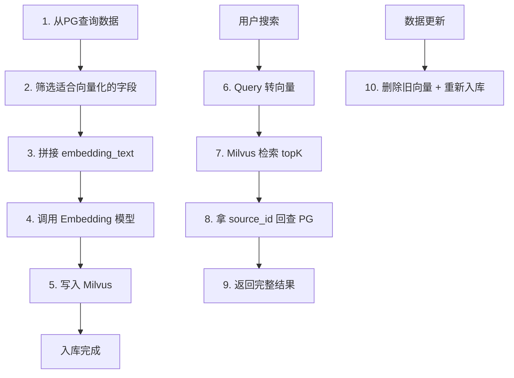

# 入库方案设计与实现

> 第二阶段核心文档：你的主要工作任务——设计并实现 PG → Milvus 的完整入库流程

---

## 学习目标

1. 判断每张表、每个字段是否适合向量化
2. 设计 embedding_text 的拼接策略
3. 实现完整的批量入库脚本
4. 处理数据更新、删除、重跑的场景

---

## 入库全流程图



---

## 第一步：分析每张表的向量化策略

### 适合向量化的表和字段

| 表 | 适合转向量的字段 | 理由 |
|----|----------------|------|
| asset_entities | name + description + tags | 这些是语义描述，用户会用自然语言搜索 |
| project_director_storyboard | description + prompt | 分镜描述有语义，适合"找类似分镜" |
| project_prompts | prompt_text | 提示词有语义，适合"找类似prompt" |

### 适合做 metadata（Milvus 标量字段，用于过滤）

| 字段 | 作用 |
|------|------|
| asset_kind | 过滤：只搜角色/只搜场景 |
| source_project_id | 过滤：只搜某个项目的资产 |
| name | 结果展示，不用回查PG就能显示名称 |

### 只保留在 PG，不进 Milvus

| 字段/表 | 理由 |
|---------|------|
| asset_media.storage_path | 文件路径无语义，不需要向量化 |
| asset_media.media_type | 枚举值，用PG过滤即可 |
| asset_variants.params | JSON参数，无语义 |
| project_asset_refs | 纯关联关系表，无文本内容 |
| created_at / updated_at | 时间戳无语义 |

### 不应该直接向量化的表

| 表 | 理由 | 替代方案 |
|----|------|---------|
| asset_media | 只有路径和类型，无语义文本 | 如果要做图片搜索，用CLIP模型对图片本身做embedding |
| asset_variants | 变体参数是结构化的 | 用PG查询即可 |
| project_asset_refs | 纯关联表 | 用PG JOIN或Neo4j |

---

## 第二步：设计 embedding_text 拼接策略

```python
def build_embedding_text(asset: dict) -> str:
    """把资产的语义字段拼成一段文本用于embedding"""
    parts = []
    
    # 名称（权重高，放前面）
    if asset.get("name"):
        parts.append(f"名称：{asset['name']}")
    
    # 描述（核心语义信息）
    if asset.get("description"):
        parts.append(f"描述：{asset['description']}")
    
    # 标签
    if asset.get("tags"):
        tags = ", ".join(asset["tags"]) if isinstance(asset["tags"], list) else asset["tags"]
        parts.append(f"标签：{tags}")
    
    # 类型
    if asset.get("asset_kind"):
        parts.append(f"类型：{asset['asset_kind']}")
    
    return "\n".join(parts)

# 示例输出：
# "名称：白衣仙女\n描述：一个身穿白色纱裙的古风仙女角色，气质飘逸出尘\n标签：古风, 仙侠, 女性\n类型：character"
```

**拼接原则：**
- 语义最丰富的字段（description）一定要包含
- name 放最前面，搜索时名称匹配权重自然高
- 枚举字段（asset_kind）转成中文可读文本再拼
- 空字段跳过，不要拼出"描述：None"

---

## 第三步：完整入库脚本

```python
import psycopg2
from pymilvus import connections, Collection
from typing import List, Dict
import time

# ========== 配置 ==========
PG_CONFIG = {"host": "localhost", "port": 5432, "dbname": "drama", "user": "postgres", "password": "xxx"}
MILVUS_HOST = "localhost"
MILVUS_PORT = 19530
COLLECTION_NAME = "asset_vectors"
BATCH_SIZE = 100  # 每批处理数量
EMBEDDING_MODEL = "text-embedding-3-small"  # 或用本地模型

# ========== 1. 从PG查询数据 ==========
def fetch_assets_from_pg(offset: int = 0, limit: int = 100) -> List[Dict]:
    conn = psycopg2.connect(**PG_CONFIG)
    cursor = conn.cursor()
    cursor.execute("""
        SELECT id, name, description, asset_kind, source_project_id, tags
        FROM asset_entities
        ORDER BY id
        OFFSET %s LIMIT %s
    """, (offset, limit))
    
    columns = [desc[0] for desc in cursor.description]
    results = [dict(zip(columns, row)) for row in cursor.fetchall()]
    conn.close()
    return results

# ========== 2. 拼接embedding文本 ==========
def build_embedding_text(asset: dict) -> str:
    parts = []
    if asset.get("name"):
        parts.append(f"名称：{asset['name']}")
    if asset.get("description"):
        parts.append(f"描述：{asset['description']}")
    if asset.get("tags"):
        tags = ", ".join(asset["tags"]) if isinstance(asset["tags"], list) else str(asset["tags"])
        parts.append(f"标签：{tags}")
    if asset.get("asset_kind"):
        parts.append(f"类型：{asset['asset_kind']}")
    return "\n".join(parts)

# ========== 3. 调用Embedding模型 ==========
def get_embeddings_batch(texts: List[str]) -> List[List[float]]:
    """批量调用embedding API（这里用伪代码，替换成你的模型）"""
    import openai
    response = openai.embeddings.create(input=texts, model=EMBEDDING_MODEL)
    return [item.embedding for item in response.data]

# ========== 4. 写入Milvus ==========
def upsert_to_milvus(collection: Collection, assets: List[Dict], vectors: List[List[float]]):
    """先删旧数据再插新数据（实现upsert）"""
    source_ids = [a["id"] for a in assets]
    
    # 删除已存在的（实现幂等）
    id_list = ", ".join([f'"{sid}"' for sid in source_ids])
    collection.delete(expr=f"source_id in [{id_list}]")
    
    # 构造插入数据
    collection.insert([
        vectors,                                                    # vector
        ["asset_entities"] * len(assets),                          # source_table
        [a["id"] for a in assets],                                 # source_id
        [a.get("asset_kind", "") for a in assets],                # asset_kind
        [a.get("source_project_id", "") for a in assets],         # source_project_id
        [a.get("name", "") for a in assets],                      # name
        [build_embedding_text(a)[:2048] for a in assets],         # text (截断防超长)
    ])

# ========== 5. 主入库流程 ==========
def run_full_ingest():
    # 连接Milvus
    connections.connect(host=MILVUS_HOST, port=MILVUS_PORT)
    collection = Collection(COLLECTION_NAME)
    collection.load()
    
    offset = 0
    total_ingested = 0
    
    while True:
        # 分批从PG取数据
        assets = fetch_assets_from_pg(offset=offset, limit=BATCH_SIZE)
        if not assets:
            break
        
        # 拼接文本
        texts = [build_embedding_text(a) for a in assets]
        
        # 批量embedding
        vectors = get_embeddings_batch(texts)
        
        # 写入Milvus
        upsert_to_milvus(collection, assets, vectors)
        
        total_ingested += len(assets)
        offset += BATCH_SIZE
        print(f"已入库: {total_ingested} 条")
        
        # 避免打爆embedding API
        time.sleep(0.5)
    
    collection.flush()
    print(f"入库完成，共 {total_ingested} 条")

if __name__ == "__main__":
    run_full_ingest()
```

---

## 第四步：数据更新/删除/重跑策略

| 场景 | 处理方式 |
|------|---------|
| **新增资产** | 取新增记录 → embedding → 插入 Milvus |
| **修改资产** | 按 source_id 删除旧向量 → 重新 embedding → 插入新向量 |
| **删除资产** | 按 source_id 从 Milvus 删除 |
| **全量重跑** | 清空 Collection → 全量重新入库 |
| **增量同步** | 用 PG 的 updated_at 字段，只取上次同步后更新的记录 |

### 增量同步代码

```python
def incremental_sync(last_sync_time: str):
    """只同步上次之后更新的数据"""
    conn = psycopg2.connect(**PG_CONFIG)
    cursor = conn.cursor()
    cursor.execute("""
        SELECT id, name, description, asset_kind, source_project_id, tags
        FROM asset_entities
        WHERE updated_at > %s
        ORDER BY updated_at
    """, (last_sync_time,))
    # ... 后续同入库流程
```

---

## 第五步：检索时的完整流程

```python
def search_assets(query: str, asset_kind: str = None, top_k: int = 10):
    """完整检索链路：query → 向量 → Milvus → 回查PG → 返回结果"""
    
    # 1. Query转向量
    query_vector = get_embeddings_batch([query])[0]
    
    # 2. 构造过滤条件
    expr = f'asset_kind == "{asset_kind}"' if asset_kind else None
    
    # 3. Milvus检索
    collection = Collection(COLLECTION_NAME)
    results = collection.search(
        data=[query_vector],
        anns_field="vector",
        param={"metric_type": "COSINE", "params": {"ef": 128}},
        limit=top_k,
        expr=expr,
        output_fields=["source_id", "name", "text"]
    )
    
    # 4. 收集source_id回查PG
    source_ids = [hit.entity.get("source_id") for hit in results[0]]
    scores = {hit.entity.get("source_id"): hit.score for hit in results[0]}
    
    # 5. 批量回查PG拿完整信息
    conn = psycopg2.connect(**PG_CONFIG)
    cursor = conn.cursor()
    cursor.execute("""
        SELECT e.*, m.url as image_url
        FROM asset_entities e
        LEFT JOIN asset_media m ON m.asset_id = e.id AND m.media_type = 'image'
        WHERE e.id = ANY(%s)
    """, (source_ids,))
    
    full_results = []
    for row in cursor.fetchall():
        asset = dict(zip([d[0] for d in cursor.description], row))
        asset["similarity_score"] = scores.get(asset["id"], 0)
        full_results.append(asset)
    
    # 6. 按相似度排序返回
    full_results.sort(key=lambda x: x["similarity_score"], reverse=True)
    return full_results
```

---

## 常见错误

1. **embedding_text 为空**：name和description都是NULL → 插入空向量无意义，要跳过
2. **source_id 重复入库**：不做去重会导致搜索出重复结果 → 用 upsert（先删后插）
3. **文本截断**：embedding模型有token上限（如8192），超长文本要截断
4. **batch大小不当**：太大OOM，太小太慢 → 100-500条一批比较合适
5. **没有错误处理**：embedding API偶尔超时，需要 try/except + 重试

---

## 实战任务

1. 跑通上面的入库脚本（可以先用5条测试数据）
2. 入库后用不同query测试搜索效果，验证语义匹配是否合理
3. 修改一条PG数据，触发增量同步，验证Milvus中的向量已更新
4. 尝试对 project_prompts 表也做一遍入库

---

## 学完应能回答

- 哪些字段适合转向量？哪些只做metadata？哪些不进Milvus？
- embedding_text 怎么拼接？为什么 description 比 id 更重要？
- 如果PG中一条资产更新了，Milvus要怎么处理？
- 为什么用 source_id 关联而不是把PG所有字段都存Milvus？
- 批量入库时需要注意什么？（batch size、限流、错误处理）
