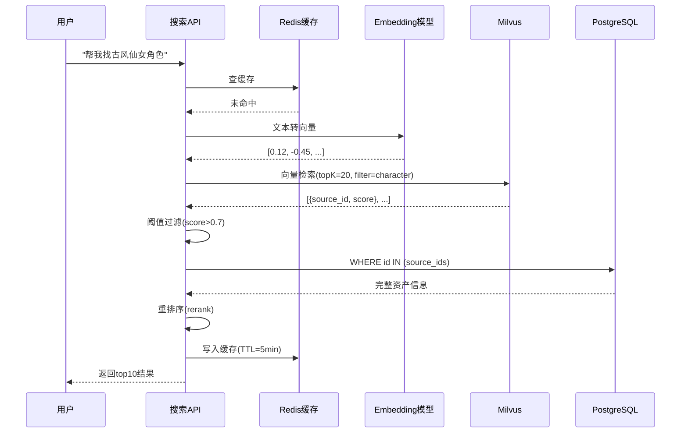

# 检索链路设计

> 第三阶段文档：设计完整的语义检索API，包含缓存、过滤、重排序、回查的全链路

---

## 学习目标

1. 能设计从用户输入到返回结果的完整检索链路
2. 理解 topK、阈值过滤、重排序(rerank)的作用
3. 掌握混合检索（关键词+语义）的设计思路
4. 能处理检索结果的质量优化问题

---

## 完整检索链路架构



---

## 各环节详解

### 1. Query 预处理

```python
def preprocess_query(raw_query: str) -> dict:
    """分析用户query，提取结构化过滤条件"""
    result = {
        "search_text": raw_query,
        "filters": {}
    }
    
    # 简单规则提取（生产环境可用LLM做意图识别）
    kind_keywords = {
        "角色": "character",
        "场景": "scene", 
        "道具": "prop",
        "分镜": "storyboard"
    }
    for kw, kind in kind_keywords.items():
        if kw in raw_query:
            result["filters"]["asset_kind"] = kind
            # 从搜索文本中移除过滤词，保留语义部分
            result["search_text"] = raw_query.replace(kw, "").strip()
            break
    
    return result
```

### 2. 向量检索 + 过滤

```python
def vector_search(query_vector: list, filters: dict, top_k: int = 20) -> list:
    """Milvus检索，多取一些再筛选"""
    # 构造过滤表达式
    expr_parts = []
    if filters.get("asset_kind"):
        expr_parts.append(f'asset_kind == "{filters["asset_kind"]}"')
    if filters.get("source_project_id"):
        expr_parts.append(f'source_project_id == "{filters["source_project_id"]}"')
    
    expr = " and ".join(expr_parts) if expr_parts else None
    
    collection = Collection("asset_vectors")
    results = collection.search(
        data=[query_vector],
        anns_field="vector",
        param={"metric_type": "COSINE", "params": {"ef": 128}},
        limit=top_k,
        expr=expr,
        output_fields=["source_id", "name", "text", "asset_kind"]
    )
    
    return [
        {"source_id": hit.entity.get("source_id"),
         "name": hit.entity.get("name"),
         "text": hit.entity.get("text"),
         "score": hit.score}
        for hit in results[0]
    ]
```

### 3. 阈值过滤

```python
def filter_by_threshold(results: list, min_score: float = 0.65) -> list:
    """过滤掉相似度太低的结果（不相关的噪音）"""
    return [r for r in results if r["score"] >= min_score]
```

### 4. 重排序(Rerank)

```python
def rerank(query: str, candidates: list, top_n: int = 10) -> list:
    """用更精确的模型对候选结果重排序"""
    # 方案A：用rerank模型（如Cohere rerank、BGE reranker）
    # 方案B：简单规则重排
    
    # 简单版：名称精确匹配加分
    for item in candidates:
        bonus = 0
        if query in item.get("name", ""):
            bonus += 0.1  # 名称包含query加分
        item["final_score"] = item["score"] + bonus
    
    candidates.sort(key=lambda x: x["final_score"], reverse=True)
    return candidates[:top_n]
```

### 5. 回查 PG 拼装完整结果

```python
def enrich_from_pg(candidates: list) -> list:
    """用source_id批量回查PG，拿完整信息"""
    source_ids = [c["source_id"] for c in candidates]
    score_map = {c["source_id"]: c["final_score"] for c in candidates}
    
    conn = psycopg2.connect(**PG_CONFIG)
    cursor = conn.cursor()
    cursor.execute("""
        SELECT e.id, e.name, e.description, e.asset_kind, e.tags,
               m.url as thumbnail_url,
               sp.project_name as source_project_name
        FROM asset_entities e
        LEFT JOIN asset_media m ON m.asset_id = e.id AND m.media_type = 'image'
        LEFT JOIN asset_source_projects sp ON sp.id = e.source_project_id
        WHERE e.id = ANY(%s)
    """, (source_ids,))
    
    results = []
    for row in cursor.fetchall():
        asset = dict(zip([d[0] for d in cursor.description], row))
        asset["score"] = score_map.get(asset["id"], 0)
        results.append(asset)
    
    results.sort(key=lambda x: x["score"], reverse=True)
    conn.close()
    return results
```

---

## 混合检索（进阶）

当语义检索和关键词检索结合时效果更好：

```python
def hybrid_search(query: str, top_k: int = 10):
    """语义检索 + 关键词检索 → RRF融合"""
    # 路径1：语义检索(Milvus)
    query_vector = get_embedding(query)
    semantic_results = vector_search(query_vector, {}, top_k=30)
    
    # 路径2：关键词检索(PG全文搜索或ES)
    keyword_results = pg_fulltext_search(query, limit=30)
    
    # RRF融合（Reciprocal Rank Fusion）
    k = 60  # RRF常数
    scores = {}
    
    for rank, item in enumerate(semantic_results):
        sid = item["source_id"]
        scores[sid] = scores.get(sid, 0) + 1 / (k + rank + 1)
    
    for rank, item in enumerate(keyword_results):
        sid = item["id"]
        scores[sid] = scores.get(sid, 0) + 1 / (k + rank + 1)
    
    # 按融合分数排序
    sorted_ids = sorted(scores, key=scores.get, reverse=True)[:top_k]
    return enrich_from_pg([{"source_id": sid, "final_score": scores[sid]} for sid in sorted_ids])
```

---

## 检索质量评估

| 指标 | 含义 | 怎么测 |
|------|------|--------|
| 召回率(Recall) | 相关结果有多少被找到了 | 标注测试集，计算找到的比例 |
| 精确率(Precision) | 返回的结果有多少是相关的 | topK中相关的/K |
| MRR | 第一个正确结果排在第几位 | 越靠前越好 |
| 延迟(Latency) | 从请求到返回的时间 | P50/P95/P99 |

---

## 常见坑

1. **topK太小**：设10但阈值过滤后只剩3条 → topK多取一些(20-50)再截断
2. **没有重排序**：向量相似度高≠最终最相关 → rerank能显著提升效果
3. **回查PG用循环单查**：每个source_id查一次 → 用 IN 批量查
4. **忽略空结果**：搜索无结果时要有兜底策略（推荐热门/换个检索方式）

---

## 学完应能回答

- 检索链路每一步的作用是什么？去掉哪一步会怎样？
- 为什么要多取topK再阈值过滤，而不是直接取最终数量？
- Rerank 和向量检索的分数有什么区别？
- 混合检索为什么比纯语义检索效果好？
- 怎么评估检索质量好不好？
