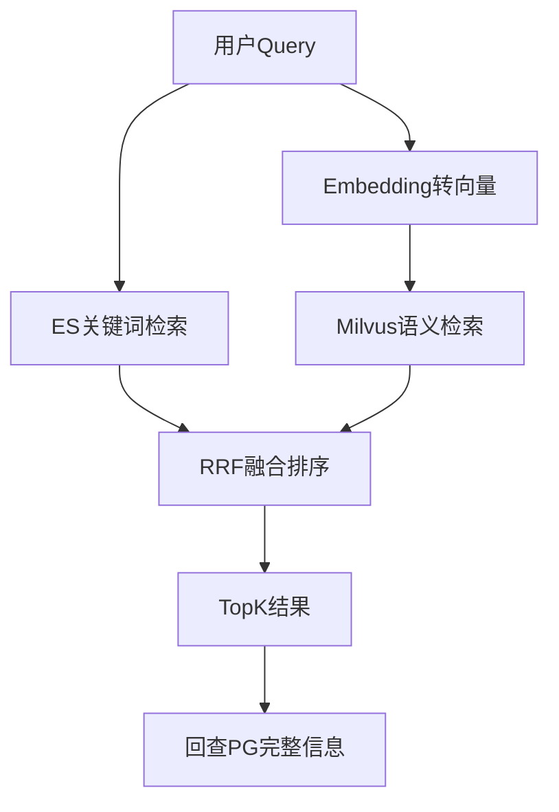

# Elasticsearch 与混合检索

> 第三阶段进阶文档：理解全文检索原理，掌握 ES 和 Milvus 的互补关系

---

## 学习目标

1. 理解倒排索引原理和 BM25 算法思想
2. 掌握 ES 基础 DSL 查询
3. 能设计 ES + Milvus 混合检索方案
4. 判断什么场景用 ES、什么场景用 Milvus

---

## ES 解决什么问题

| 搜索需求 | Milvus能做吗 | ES能做吗 |
|----------|-------------|----------|
| "帮我找类似仙女的角色" | ✅ 语义理解 | ❌ 没有"仙女"这个词就搜不到 |
| "名字叫白衣仙女的" | ❌ 不擅长精确匹配 | ✅ 精确+模糊匹配 |
| "描述中包含'飘逸'的" | ❌ | ✅ 关键词定位 |
| "古风 AND 女性 NOT 现代" | ❌ | ✅ 布尔组合查询 |
| 搜索结果高亮显示匹配词 | ❌ | ✅ |

**结论**：ES 和 Milvus 互补，混合使用效果最好。

---

## 核心概念

### 倒排索引（Inverted Index）

正排：文档 → 包含哪些词
```
doc1: "古风仙女角色" → [古风, 仙女, 角色]
doc2: "现代都市男性" → [现代, 都市, 男性]
```

倒排：词 → 出现在哪些文档
```
古风 → [doc1]
仙女 → [doc1]
角色 → [doc1]
现代 → [doc2]
```

搜索"古风角色" → 查倒排索引 → doc1 同时包含"古风"和"角色" → 命中！

### BM25 算分

决定搜索结果的排序。核心思想：
- 词在该文档中出现越多 → 分越高（词频TF）
- 词在所有文档中越少见 → 分越高（逆文档频率IDF）
- 文档越短 → 分越高（短文档中出现说明更相关）

### 分词器(Analyzer)

文本 → 切词 → 建索引。中文需要专门分词器：

| 分词器 | 效果 | 用途 |
|--------|------|------|
| standard | "古风仙女" → ["古","风","仙","女"] | 不适合中文 |
| ik_smart | "古风仙女" → ["古风","仙女"] | 中文智能分词 |
| ik_max_word | "古风仙女" → ["古风","仙女","古","风","仙","女"] | 最大粒度切分 |

---

## 基础 DSL 查询

```json
// 创建索引（相当于建表）
PUT /assets
{
  "settings": {
    "analysis": {
      "analyzer": {
        "ik_analyzer": {"type": "custom", "tokenizer": "ik_max_word"}
      }
    }
  },
  "mappings": {
    "properties": {
      "name": {"type": "text", "analyzer": "ik_max_word"},
      "description": {"type": "text", "analyzer": "ik_max_word"},
      "asset_kind": {"type": "keyword"},
      "source_project_id": {"type": "keyword"},
      "source_id": {"type": "keyword"}
    }
  }
}

// 搜索
POST /assets/_search
{
  "query": {
    "bool": {
      "must": [{"match": {"description": "古风 仙女"}}],
      "filter": [{"term": {"asset_kind": "character"}}]
    }
  },
  "highlight": {"fields": {"description": {}}},
  "size": 20
}
```

---

## 混合检索架构



### 什么时候走哪条路

| Query特征 | 走哪路 | 原因 |
|-----------|--------|------|
| 包含具体名称"白衣仙女" | ES为主 | 精确匹配ES更强 |
| 模糊描述"看起来很仙的" | Milvus为主 | 语义理解Milvus更强 |
| 混合"古风风格的女性角色" | 两路融合 | 有关键词也有语义 |

---

## 和 Milvus 的选型决策

| 如果你的项目… | 建议 |
|--------------|------|
| 只需要语义搜索 | Milvus 就够 |
| 需要关键词精确匹配+高亮 | 加 ES |
| 需要最好的检索效果 | ES + Milvus 混合 |
| 还需要日志分析/聚合统计 | ES 一举两得 |
| 预算有限/运维简单 | 先只用 Milvus，效果不够再加 ES |

---

## 常见坑

1. **中文分词器没装**：默认standard按单字切，搜索效果很差
2. **keyword vs text 搞混**：keyword精确匹配(过滤用)，text分词匹配(搜索用)
3. **mapping不能改字段类型**：建错了要删索引重建
4. **近实时不是实时**：写入后1秒才能搜到(refresh_interval)
5. **深分页OOM**：from=10000, size=10 → 用 search_after 替代

---

## 学完应能回答

- 倒排索引的原理是什么？和B-tree索引有什么区别？
- 为什么中文搜索必须用专门的分词器？
- ES和Milvus分别适合什么类型的查询？
- 混合检索的RRF融合是怎么工作的？
- 什么情况下只用Milvus就够，什么时候必须加ES？
