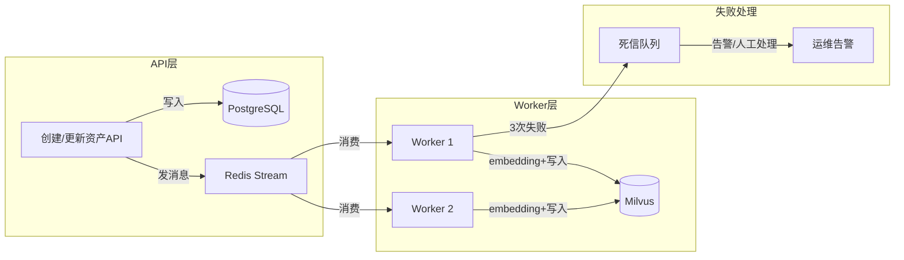

# 消息队列与异步架构

> 第四阶段文档：理解异步任务在智能体系统中的必要性，掌握 PG→Milvus 异步同步方案

---

## 学习目标

1. 理解为什么入库和同步需要异步化
2. 掌握消息队列的基本模式（生产-消费、重试、死信）
3. 能设计 PG 数据变更 → 异步 embedding → 写入 Milvus 的完整方案
4. 理解削峰填谷在高并发场景中的价值

---

## 为什么需要异步

同步方式的问题：
```
用户创建资产 → 写PG(20ms) → 调embedding(200ms) → 写Milvus(30ms) → 返回
总耗时 250ms，用户等得久；如果embedding超时，整个请求失败
```

异步方式：
```
用户创建资产 → 写PG(20ms) → 发消息到队列(2ms) → 立即返回(22ms)
后台Worker：从队列取消息 → embedding → 写Milvus（用户无感知）
```

**核心价值**：快速响应 + 故障隔离 + 削峰填谷

---

## 消息队列选型

| | Kafka | RabbitMQ | Redis Stream |
|---|-------|----------|--------------|
| 吞吐 | 百万/秒 | 万/秒 | 十万/秒 |
| 复杂度 | 高 | 中 | 低 |
| 消息回放 | ✅ | ❌ | 有限支持 |
| 适合 | 大数据/事件流 | 可靠任务队列 | 轻量/已有Redis |
| **你的项目建议** | 数据量大时用 | 需要可靠投递时用 | **起步推荐**（简单） |

---

## 异步入库架构



---

## 完整实现（Redis Stream方案）

### 生产者：API层发送消息

```python
import redis
import json
import time

r = redis.Redis(host='localhost', port=6379, decode_responses=True)
STREAM_KEY = "asset_sync_tasks"

def on_asset_created(asset_id: str):
    """资产创建后触发"""
    r.xadd(STREAM_KEY, {
        "action": "upsert",
        "asset_id": asset_id,
        "timestamp": str(time.time()),
        "retry_count": "0"
    })

def on_asset_updated(asset_id: str):
    """资产更新后触发"""
    r.xadd(STREAM_KEY, {
        "action": "upsert",
        "asset_id": asset_id,
        "timestamp": str(time.time()),
        "retry_count": "0"
    })

def on_asset_deleted(asset_id: str):
    """资产删除后触发"""
    r.xadd(STREAM_KEY, {
        "action": "delete",
        "asset_id": asset_id,
        "timestamp": str(time.time()),
        "retry_count": "0"
    })
```

### 消费者：Worker处理消息

```python
CONSUMER_GROUP = "embedding_workers"
CONSUMER_NAME = "worker_1"
MAX_RETRIES = 3
DLQ_KEY = "asset_sync_dlq"

def start_worker():
    # 创建消费组（首次运行）
    try:
        r.xgroup_create(STREAM_KEY, CONSUMER_GROUP, id="0", mkstream=True)
    except redis.ResponseError:
        pass
    
    print(f"Worker {CONSUMER_NAME} started")
    while True:
        messages = r.xreadgroup(
            CONSUMER_GROUP, CONSUMER_NAME,
            {STREAM_KEY: ">"},
            count=10,    # 每次最多取10条
            block=5000   # 无消息时阻塞等5秒
        )
        
        if not messages:
            continue
        
        for stream, msgs in messages:
            for msg_id, data in msgs:
                try:
                    process_message(data)
                    r.xack(STREAM_KEY, CONSUMER_GROUP, msg_id)
                except Exception as e:
                    handle_failure(msg_id, data, e)

def process_message(data: dict):
    """处理单条消息"""
    action = data.get("action", "upsert")
    asset_id = data.get("asset_id")
    
    if action == "delete":
        # 从Milvus删除
        collection.delete(expr=f'source_id == "{asset_id}"')
    else:
        # 从PG取最新数据
        asset = fetch_asset_from_pg(asset_id)
        if not asset:
            return  # PG中已不存在，跳过
        
        # 生成embedding
        text = build_embedding_text(asset)
        vector = get_embedding(text)
        
        # 写入Milvus（先删后插实现upsert）
        collection.delete(expr=f'source_id == "{asset_id}"')
        collection.insert([[vector], ["asset_entities"], [asset_id], ...])
        collection.flush()

def handle_failure(msg_id: str, data: dict, error: Exception):
    """失败处理：重试或进死信队列"""
    retry_count = int(data.get("retry_count", 0))
    
    if retry_count < MAX_RETRIES:
        # 重新发送，增加重试计数
        data["retry_count"] = str(retry_count + 1)
        r.xadd(STREAM_KEY, data)
        r.xack(STREAM_KEY, CONSUMER_GROUP, msg_id)
        print(f"重试 {retry_count+1}/{MAX_RETRIES}: {data['asset_id']}")
    else:
        # 超过重试次数，进死信队列
        data["error"] = str(error)
        r.xadd(DLQ_KEY, data)
        r.xack(STREAM_KEY, CONSUMER_GROUP, msg_id)
        print(f"进入死信队列: {data['asset_id']}, error: {error}")
```

---

## 关键设计模式

### 1. 幂等性

同一条消息可能被消费多次（网络抖动、重试），处理逻辑必须幂等：
```python
# ✅ 幂等：先删后插，执行多次结果一样
collection.delete(expr=f'source_id == "{asset_id}"')
collection.insert(new_data)

# ❌ 非幂等：重复执行会产生重复数据
collection.insert(new_data)
```

### 2. 批量处理

```python
# 攒够一批再处理，减少API调用次数
batch = []
for msg in messages:
    batch.append(msg)
    if len(batch) >= 50:
        texts = [build_embedding_text(a) for a in batch]
        vectors = get_embeddings_batch(texts)  # 一次API调用处理50条
        batch_upsert_milvus(batch, vectors)
        batch = []
```

### 3. 监控告警

```python
def check_queue_health():
    """定时检查队列健康状态"""
    # 待处理消息数
    info = r.xinfo_stream(STREAM_KEY)
    pending = info["length"]
    
    if pending > 1000:
        alert("消息积压！待处理: {pending}")
    
    # 死信队列数量
    dlq_len = r.xlen(DLQ_KEY)
    if dlq_len > 0:
        alert(f"死信队列有 {dlq_len} 条失败消息待处理")
```

---

## 高并发场景：削峰填谷

```
正常: 10个资产/秒创建 → Worker处理得过来
突发: 1000个资产同时导入 → 不用队列：Milvus/embedding API被打爆
                        → 用队列：消息排队，Worker匀速消费(50条/秒)
```

多Worker水平扩展：消息积压时启动更多Worker并行消费。

---

## 常见坑

1. **消息丢失**：发消息后没确认 → 用Redis Stream的ACK机制
2. **消费者挂了不知道**：需要健康检查+自动重启(supervisor/k8s)
3. **顺序问题**：先update后delete，如果乱序Milvus里会残留脏数据 → 同一asset_id保证顺序
4. **死信堆积不管**：要定期检查死信队列，修复根因后重新投递

---

## 学完应能回答

- 为什么创建资产后不同步写Milvus，而是用消息队列异步？
- 消息消费失败怎么办？什么是死信队列？
- 什么是幂等性？为什么异步消费必须幂等？
- 突发大量数据导入时消息队列怎么帮忙？
- 怎么保证同一个资产的消息按顺序处理？
