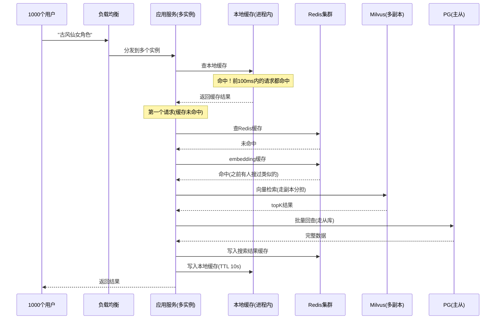

# 高并发数据库架构

> 第四阶段文档：理解1000人同时搜索时系统如何抗压，掌握各组件的高并发应对策略

---

## 学习目标

1. 理解一次搜索请求在高并发下经过的完整链路
2. 掌握各组件（PG/Redis/Milvus）的抗压手段
3. 能识别系统瓶颈并提出优化方案
4. 理解数据一致性在分布式系统中的取舍

---

## 场景：1000人同时搜索"古风仙女角色"

### 没有优化时会发生什么

```
1000个请求 → 每个都调embedding API(200ms) → 1000次API调用(费用爆炸)
           → 每个都查Milvus → 1000次向量检索(Milvus压力大)
           → 每个都回查PG → 1000次SQL查询(PG连接池耗尽)
           → 总延迟：每人等300ms+，系统可能直接崩
```

### 优化后的完整链路



**结果**：1000个请求中，可能只有1-2个真正打到Milvus和PG。

---

## 各组件抗压策略

### 1. Redis：第一道防线

| 策略 | 实现 | 效果 |
|------|------|------|
| 搜索结果缓存 | 相同query命中缓存 | 减少99%的Milvus+PG请求 |
| Embedding缓存 | 相同文本不重复调API | 省钱+减少延迟 |
| 热点key本地缓存 | 进程内缓存10秒 | 连Redis都不用打 |
| 集群模式 | Redis Cluster 多节点 | 单节点10万QPS→集群百万QPS |

### 2. Milvus：向量检索层

| 策略 | 实现 | 效果 |
|------|------|------|
| 多副本(Replica) | 读请求分散到多个副本 | 线性提升搜索吞吐 |
| 分片(Shard) | 数据分到多个节点并行搜 | 单次搜索更快 |
| nprobe/ef调优 | 降低精度换速度 | 延迟从50ms降到20ms |
| 预热 | 服务启动时load+warmup查询 | 避免冷启动慢 |

### 3. PostgreSQL：回查层

| 策略 | 实现 | 效果 |
|------|------|------|
| 连接池(PgBouncer) | 100连接服务1000+请求 | 防止连接耗尽 |
| 读写分离 | 搜索回查走从库 | 读写互不干扰 |
| 批量查询 | WHERE id IN (...) | 10个ID一次查，不要循环10次 |
| 索引优化 | 主键查询走索引 | 回查O(1)不会慢 |

### 4. 应用层

| 策略 | 实现 | 效果 |
|------|------|------|
| 多实例部署 | 3-5个应用实例 | 分担请求处理 |
| 本地缓存(L1) | 进程内缓存热门结果10s | 最快的缓存层 |
| 限流 | 每用户每秒最多30次搜索 | 防止恶意刷接口 |
| 降级 | Milvus不可用时走ES/PG | 保证基本可用 |

---

## 多级缓存架构

```
请求 → L1本地缓存(10s TTL, 进程内dict)
     → L2 Redis缓存(5min TTL)  
     → L3 Milvus + PG(真正的检索)
```

```python
import time
from functools import lru_cache

# L1: 进程内缓存（最快，但每个实例独立）
local_cache = {}

def search_with_multilevel_cache(query: str):
    cache_key = f"search:{hash(query)}"
    
    # L1: 本地缓存(10秒)
    if cache_key in local_cache:
        entry = local_cache[cache_key]
        if time.time() - entry["time"] < 10:
            return entry["data"]
    
    # L2: Redis缓存(5分钟)
    cached = r.get(cache_key)
    if cached:
        data = json.loads(cached)
        local_cache[cache_key] = {"data": data, "time": time.time()}
        return data
    
    # L3: 真正的检索
    results = full_search_pipeline(query)
    
    # 回写两级缓存
    r.setex(cache_key, 300, json.dumps(results))
    local_cache[cache_key] = {"data": results, "time": time.time()}
    return results
```

---

## 批量入库不影响线上搜索

| 策略 | 做法 |
|------|------|
| 分时段执行 | 凌晨低峰期跑全量重建 |
| 限流入库 | 每秒最多处理50条，不抢Milvus资源 |
| 读写分离 | 入库写主Milvus，搜索读副本 |
| 分批flush | 不要一次flush百万条，分批flush |

---

## 数据一致性

PG 和 Milvus 之间是**最终一致性**：

```
时间线：
t0: PG更新资产描述 ← 此时PG是新数据
t1: 发消息到队列
t2: Worker消费，开始embedding  ← Milvus还是旧数据(不一致窗口)
t3: 写入Milvus完成 ← 此时PG和Milvus都是新数据(一致了)

不一致窗口：t0→t3，通常几秒到几十秒
```

**可接受吗？** 对于搜索场景，几秒的延迟完全可以接受。用户不会注意到刚改的描述过几秒才影响搜索结果。

**不可接受的场景**：如果是交易/支付，必须强一致。但搜索不需要。

---

## 常见坑

1. **没有限流**：一个用户疯狂刷搜索把系统打崩 → 加 rate limit
2. **缓存key粒度太粗**：所有搜索共用一个缓存 → 按query+filter做细粒度key
3. **连接池太小**：100个请求争抢10个PG连接 → 排队超时 → 调大连接池
4. **同步调用embedding**：API层同步等embedding返回 → 超时 → 改异步
5. **单点故障**：Redis单节点挂了全部打穿 → Redis集群 + 降级方案

---

## 实战任务

1. 画出你项目中"搜索角色资产"的完整高并发架构图
2. 计算：如果有10万用户，每人每天搜索10次，需要多大的Redis缓存？
3. 配置PgBouncer连接池，对比有/无连接池时的并发性能
4. 实现简单的接口限流（每用户每分钟30次）

---

## 学完应能回答

- 1000人同时搜索时，请求经过哪些层？每层挡住多少请求？
- 为什么需要多级缓存？L1和L2的区别是什么？
- PG和Milvus之间的数据一致性是怎么保证的？延迟多久可接受？
- 批量入库时怎么避免影响线上搜索？
- 什么是降级？Milvus挂了怎么办？
