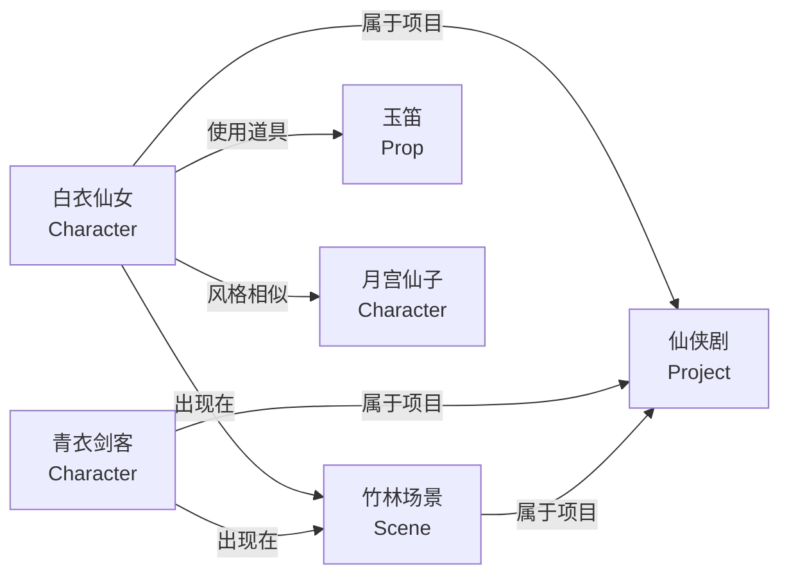

# Neo4j 与知识图谱

> 第四阶段进阶文档：理解图数据库在智能体中的作用，掌握实体关系建模

---

## 学习目标

1. 理解什么场景需要图数据库（而不是 PG JOIN）
2. 掌握 Cypher 查询语言基础
3. 能为短剧资产系统设计知识图谱
4. 理解图检索 + 向量检索的组合策略

---

## 什么时候需要图数据库

用 PG JOIN 可以解决的：
```sql
-- 查某角色出现在哪些场景（一跳关系）
SELECT * FROM project_asset_refs WHERE asset_id = 'char_001';
```

用 PG JOIN 很痛苦的：
```
-- 找到"和白衣仙女同项目的其他角色曾出现在的所有场景的关联道具"
-- 这是3-4跳关系，SQL要写4层嵌套JOIN，性能极差
```

**判断标准**：关系跳数 > 2，或者关系本身是核心查询对象时，用图数据库。

---

## 短剧资产知识图谱设计



### 节点类型

| 节点 | 对应PG表 | 属性 |
|------|---------|------|
| Character | asset_entities(kind=character) | name, style, gender |
| Scene | asset_entities(kind=scene) | name, mood, setting |
| Prop | asset_entities(kind=prop) | name, category |
| Project | asset_source_projects | name, genre |
| Storyboard | project_director_storyboard | scene_index, description |

### 边类型

| 关系 | 含义 | 来源 |
|------|------|------|
| APPEARS_IN | 角色出现在场景中 | project_asset_refs |
| BELONGS_TO | 资产属于项目 | source_project_id |
| USES_PROP | 角色使用道具 | 分镜脚本提取 |
| SIMILAR_TO | 风格相似 | 向量相似度计算 |
| NEXT_SCENE | 场景顺序 | storyboard scene_index |

---

## Cypher 基础查询

```cypher
// 创建节点
CREATE (c:Character {id: "char_001", name: "白衣仙女", style: "古风"})
CREATE (s:Scene {id: "scene_001", name: "竹林"})

// 创建关系
MATCH (c:Character {id: "char_001"}), (s:Scene {id: "scene_001"})
CREATE (c)-[:APPEARS_IN]->(s)

// 一跳查询：白衣仙女出现在哪些场景？
MATCH (c:Character {name: "白衣仙女"})-[:APPEARS_IN]->(s:Scene)
RETURN s.name

// 两跳查询：和白衣仙女同场景的其他角色？
MATCH (c1:Character {name: "白衣仙女"})-[:APPEARS_IN]->(s)<-[:APPEARS_IN]-(c2:Character)
WHERE c1 <> c2
RETURN c2.name, s.name

// 三跳：白衣仙女的"协作网络"（同项目的所有角色出现的所有场景）
MATCH (c:Character {name: "白衣仙女"})-[:BELONGS_TO]->(p:Project)<-[:BELONGS_TO]-(c2:Character)-[:APPEARS_IN]->(s:Scene)
RETURN DISTINCT s.name, c2.name

// 路径查询：两个角色之间有什么关联？
MATCH path = shortestPath(
    (c1:Character {name: "白衣仙女"})-[*..5]-(c2:Character {name: "青衣剑客"})
)
RETURN path
```

---

## 图 + 向量检索组合

**策略**：先用图查询缩小候选范围，再用 Milvus 做语义精排。

```python
def graph_enhanced_search(query: str, context_asset_id: str = None):
    """
    场景：用户正在编辑"白衣仙女"，搜索"适合的场景"
    1. 先查图：找到和白衣仙女相关的场景（同项目、同风格）
    2. 再在这个范围内做向量检索
    """
    candidates = []
    
    if context_asset_id:
        # 图查询：获取关联资产ID（缩小范围）
        cypher = """
        MATCH (c:Character {id: $asset_id})-[:BELONGS_TO]->(p:Project)<-[:BELONGS_TO]-(s:Scene)
        RETURN s.id as scene_id
        UNION
        MATCH (c:Character {id: $asset_id})-[:APPEARS_IN]->(s:Scene)
        RETURN s.id as scene_id
        """
        graph_results = neo4j_session.run(cypher, asset_id=context_asset_id)
        candidates = [r["scene_id"] for r in graph_results]
    
    # 在候选范围内做向量检索
    query_vector = get_embedding(query)
    
    if candidates:
        id_filter = ", ".join([f'"{c}"' for c in candidates])
        expr = f'source_id in [{id_filter}] and asset_kind == "scene"'
    else:
        expr = 'asset_kind == "scene"'
    
    return milvus_search(query_vector, expr=expr, top_k=10)
```

**好处**：
- 减少 Milvus 搜索范围 → 更快更准
- 结合业务关系 → 推荐更合理（不会推荐完全无关项目的场景）

---

## 常见坑

1. **把简单关系也放Neo4j**：一对多直接用PG JOIN，别过度设计
2. **全量导入性能差**：用 UNWIND 批量导入，不要一条条 CREATE
3. **查询不限深度**：`-[*]->` 不限跳数会爆炸 → 始终加上限 `-[*..3]->`
4. **和PG数据不同步**：PG改了Neo4j没更新 → 同入库一起异步同步

---

## 学完应能回答

- 什么时候用 Neo4j 而不是 PG JOIN？判断标准是什么？
- 你项目中可以建哪些节点和边？
- 图查询 + 向量检索怎么配合？好处是什么？
- Cypher 的 MATCH 模式匹配怎么理解？
